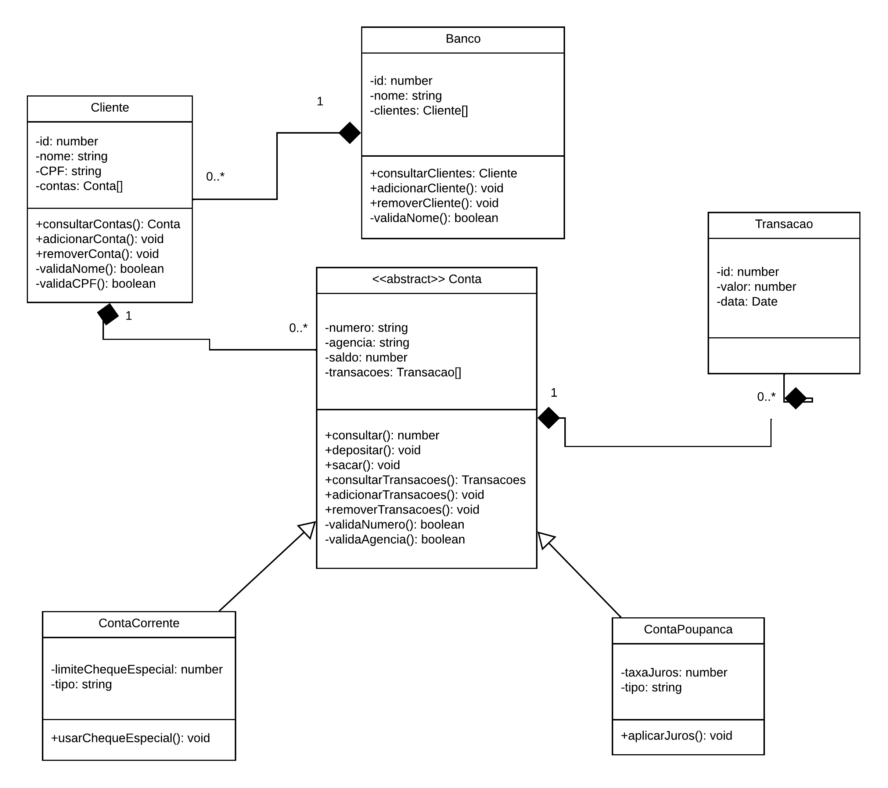

# Trabalho Final - Programação Orientada a Objetos

## 📖 Sobre
O software a ser desenvolvido é um sistema bancário básico que permitirá a gestão de clientes, contas correntes, contas poupança e transações bancárias. 

O objetivo principal é fornecer funcionalidades para adicionar e remover clientes, gerenciar contas associadas a esses clientes, registrar transações e aplicar operações específicas como cheque especial e juros em contas poupança.

## 📋 Descrição da linguagem escolhida
TypeScript é um superconjunto de JavaScript que adiciona tipagem estática e outros recursos avançados. Ele é desenvolvido e mantido pela Microsoft e é amplamente utilizado para o desenvolvimento deaplicações web, pois permite a detecção de erros em tempo de compilação, tornando o código mais robusto e fácil de manter.

Vantagens do TypeScript:
* Tipagem Estática: Ajuda a detectar erros de tipo antes da execução do código.
* Suporte a Classes e Interfaces: Facilita a programação orientada a objetos, que é útil para implementar estruturas complexas.
* Integração com JavaScript: Todo código JavaScript é um código TypeScript, permitindo uma migração gradual.


 ## 🏛️ Diagrama de classe

<div>
     
</div>

## Instalação
1. Clonar o repositório:

`````
git clone https://github.com/guilhermesvm/banco-poo.git
`````

2. Abra o projeto com VSCode ou outra IDE de desenvolvimento;
3. Em um terminal bash, digite os seguintes comandos:

* `````npm run build`````

* `````npm run dev`````

## 👥 Autores
 * [Guilherme S. Machado](https://github.com/guilhermesvm)
 * [Murilo K. Klein](https://github.com/muriloklein)